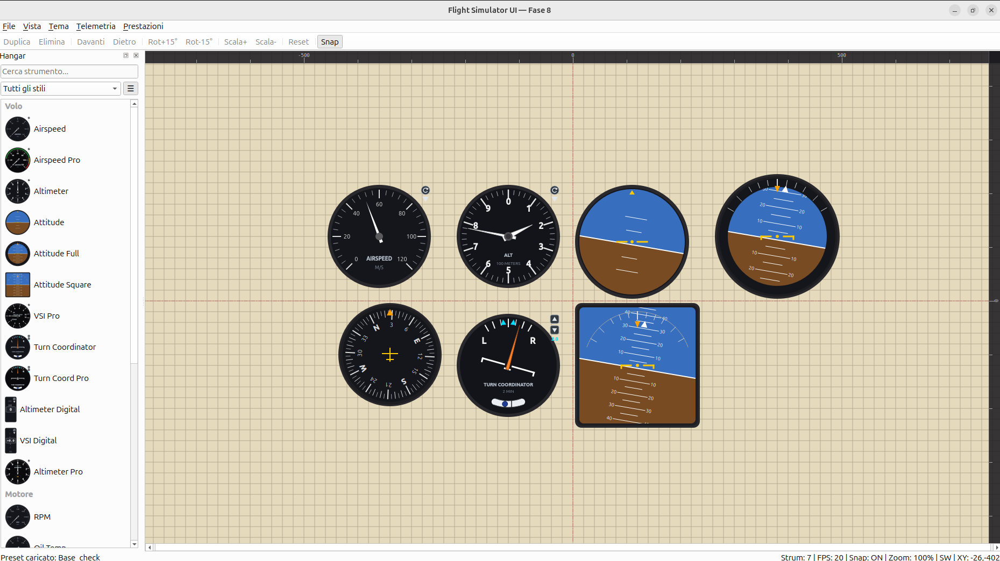
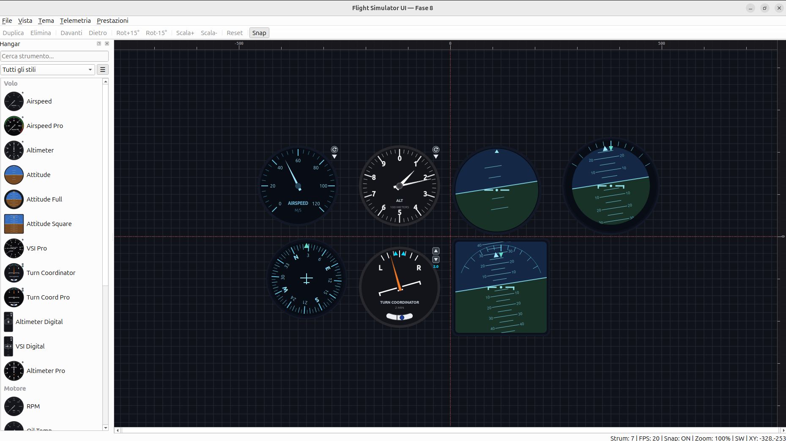
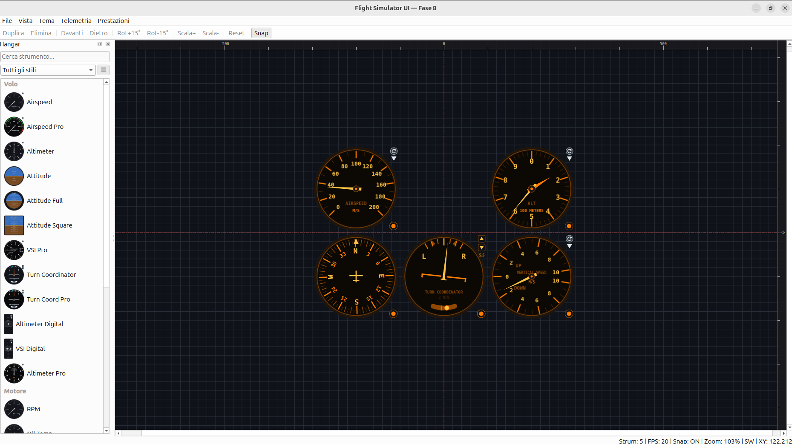
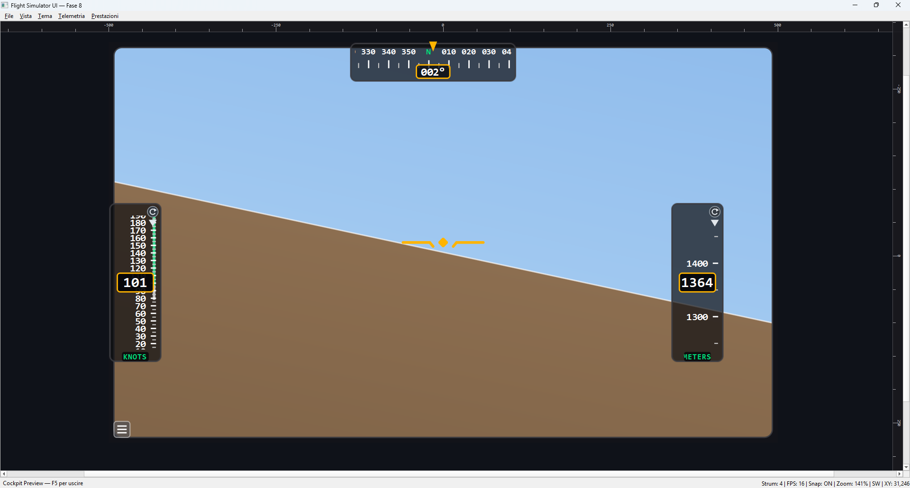

# Flight Simulator MODULAR UI — V0.3

Interfaccia grafica modulare per un simulatore di volo, costruita con Python e PySide6 (Qt 6).
Il progetto gestisce esclusivamente la componente visiva e l'interazione UI: la fisica e la logica
di simulazione sono demandate a un modulo backend separato, collegabile tramite adapter dedicato.

---

## Preview

<p align="center">
  
  
</p>
<p align="center">
  
  
</p>


## Indice

- [Struttura del pacchetto](#struttura-del-pacchetto)
- [Avvio e dipendenze](#avvio-e-dipendenze)
- [Fasi di sviluppo completate](#fasi-di-sviluppo-completate)
- [Sistema di temi](#sistema-di-temi)
- [Catalogo strumenti](#catalogo-strumenti)
- [Mixin e architettura](#mixin-e-architettura)
- [Sistema di unità di misura](#sistema-di-unità-di-misura)
- [Telemetria e integrazione backend](#telemetria-e-integrazione-backend)
- [Hangar e barra di ricerca](#hangar-e-barra-di-ricerca)
- [Controlli e scorciatoie](#controlli-e-scorciatoie)
- [Status bar](#status-bar)
- [Persistenza layout](#persistenza-layout)
- [Prestazioni](#prestazioni)
- [Cockpit Preview](#cockpit-preview)
- [Preset di pannello](#preset-di-pannello)
- [Scena](#scena)
- [Prossimi passi](#prossimi-passi)
- [Collaborazione e contratto dati](#collaborazione-e-contratto-dati)

---

## Struttura del pacchetto

```
sim_ui/
├── __init__.py
├── main.py                     # Entry point
│
├── core/                       # Logica trasversale
│   ├── __init__.py
│   ├── constants.py            # MIME type, griglia, versione schema
│   ├── prototype.py            # InstrumentPrototype + InstrumentRegistry
│   ├── units.py                # UnitDefinition + definizioni unità
│   ├── telemetry.py            # TelemetryData + adapter (Mock/External)
│   └── theme.py                # InstrumentTheme + ThemeRegistry
│
├── instruments/                # Strumenti grafici
│   ├── __init__.py
│   ├── base.py                 # BaseInstrument, UnitButtonsMixin, Placeholder
│   ├── circular.py             # CircularGauge (gauge circolare con tema)
│   ├── gauges.py               # Strumenti stile BASE
│   ├── digital.py              # Strumenti digitali
│   ├── attitude.py             # Strumenti di assetto
│   ├── professional.py         # Strumenti stile PROFESSIONAL
│   ├── advance_instr.py        # Strumenti avanzati
│   ├── comfort_instr.py        # Strumenti con comfort visivo
│   └── factory.py              # InstrumentFactory (type_id → classe)
│
└── ui/                         # Interfaccia
    ├── __init__.py
    ├── hangar_instr.py         # Hangar con barra di ricerca + drag&drop
    ├── scene.py                # InstrumentScene (griglia, snap)
    ├── view.py                 # InstrumentGraphicsView + FPSCounter
    └── window.py               # MainWindow (menu, toolbar, editing, salvataggi)
```

### Responsabilità dei moduli


| Modulo                         | Responsabilità                                                            |
| ------------------------------ | -------------------------------------------------------------------------- |
| `core/constants.py`            | Costanti globali (MIME, griglia, schema)                                   |
| `core/prototype.py`            | Definizione prototipi e catalogo strumenti                                 |
| `core/units.py`                | Definizioni unità, fattori di conversione, helper `unit_index`             |
| `core/telemetry.py`            | Struttura dati telemetria e adapter                                        |
| `core/theme.py`                | Parametri visivi centralizzati (inclusi sfondo scena e griglia)            |
| `instruments/base.py`          | Classe base + mixin riutilizzabili                                         |
| `instruments/circular.py`      | Gauge circolare generica riutilizzabile                                    |
| `instruments/gauges.py`        | Strumenti analogici Base (anemometro, altimetro, RPM, olio, heading, turn) |
| `instruments/digital.py`       | Strumenti digitali con nastro scorrevole                                   |
| `instruments/attitude.py`      | Orizzonti artificiali (semplice, full, square)                             |
| `instruments/professional.py`  | Strumenti con design professionale                                         |
| `instruments/advance_instr.py` | Strumenti avanzati (GI 275)                                                |
| `instruments/comfort_instr.py` | Strumenti Comfort anti-affaticamento                                       |
| `instruments/factory.py`       | Mappatura type_id → classe concreta                                       |
| `ui/hangar_instr.py`           | Pannello laterale con ricerca e drag                                       |
| `ui/scene.py`                  | Scena grafica con griglia colorata per tema                                |
| `ui/view.py`                   | Vista con zoom, pan, drop, OpenGL, FPS                                     |
| `ui/window.py`                 | Finestra principale, menu, toolbar, editing, persistenza                   |

---

## Avvio e dipendenze

### Dipendenze (`requirements.txt`)

```
PySide6>=6.5.0
```

> QtOpenGLWidgets è incluso nel pacchetto PySide6. Non servono dipendenze aggiuntive.

### Avvio

```bash
python -m sim_ui
# oppure
python -m sim_ui.main

---


```

## Fasi di sviluppo completate


| Fase        | Contenuto                                                        | Stato |
| ----------- | ---------------------------------------------------------------- | ----- |
| 1           | Canvas MVP (scena + placeholder)                                 | ✅    |
| 2           | Catalogo e Hangar                                                | ✅    |
| 3           | Drag & Drop                                                      | ✅    |
| 4           | Editing layout, snap, context menu, toolbar                      | ✅    |
| 5           | Persistenza JSON                                                 | ✅    |
| 6           | Rendering QPainter + strumenti reali                             | ✅    |
| 7           | Adapter telemetria + API backend                                 | ✅    |
| 8           | Zoom/Pan/RubberBand/Fullscreen/OpenGL/FPS/Stress test/FPS target | ✅    |
| Refactor    | Split file, mixin, rinomine, riorganizzazione                    | ✅    |
| Comfort     | 5 strumenti stile Comfort (Orange/Green)                         | ✅    |
| Avanzati    | Attitude GI 275 con tape airspeed integrata                      | ✅    |
| Salvataggio | Unità, target, palette, tema nel JSON                           | ✅    |
| Temi        | Sfondo e griglia controllati dal tema                            | ✅    |
| Hangar avanzato | Thumbnail, filtro stile, toggle lista                            | ✅    |
| Cockpit Preview | Modalità sola visualizzazione (F5)                              | ✅    |
| Preset di pannello | Libreria layout salvabili                                        | ✅    |
| Ottimizzazioni | Culling telemetrico + cache strumenti                           | ✅    |
| Contratto SI | Telemetria in Sistema Internazionale                              | ✅    |
| Scena       | Righelli viewport + linee centrali                                 | ✅    |

---

## Sistema di temi

### Architettura

- **`InstrumentTheme`** (dataclass): contiene tutti i parametri visivi.
- **`ThemeRegistry`**: catalogo dei temi con tema di default.
- **`BaseInstrument.set_theme()` / `theme()`**: assegna/legge il tema con invalidazione cache.
- **Menu "Tema"** nel MainWindow per cambio a runtime.

### Campi del tema


| Gruppo      | Campi                                                                                     |
| ----------- | ----------------------------------------------------------------------------------------- |
| Bezel       | `bezel_color`, `bezel_ring_color`                                                         |
| Quadrante   | `dial_color`                                                                              |
| Tacche      | `tick_major_color`, `tick_minor_color`, `tick_major_width`, `tick_minor_width`            |
| Testo       | `text_color`, `text_secondary_color`, `text_tertiary_color`, `font_family`, `font_size_*` |
| Lancette    | `needle_color`, `needle_hub_color`                                                        |
| Attitude    | `sky_color`, `ground_color`, `horizon_color`, `pitch_ladder_color`                        |
| Riferimenti | `reference_color`, `aircraft_symbol_color`                                                |
| Scena       | `selection_color`, `scene_background`, `grid_color`                                       |

### Temi definiti


| Tema      | Sfondo scena              | Descrizione                             |
| --------- | ------------------------- | --------------------------------------- |
| **Base**  | Canapa RGB(230, 218, 188) | Stile originale, sfondo chiaro          |
| **Night** | Scuro RGB(15, 18, 25)     | Toni blu scuro con accenti ciano (test) |

> **Nota**: gli stili *Professional*, *Comfort*, *Advance* e futuri *Minimal* non sono temi di colore ma
> **strumenti ridisegnati** con design proprio (classi separate).

---

## Catalogo strumenti

### Stili disponibili


| Stile                      | Descrizione                                    | Stato       |
| -------------------------- | ---------------------------------------------- | ----------- |
| **Base**                   | Stile originale, colori piatti                 | ✅ Completo |
| **Professional**           | Bezel metallico, viti, effetto vetro, dettagli | 🔄 Parziale |
| **Digital**                | Display digitali con nastro scorrevole         | ✅ Completo |
| **Advance**                | Alta fedeltà ispirati a strumenti reali (GI 275) | ✅ In crescita |
| **Minimal**                | Minimal da sovrapporre a video                 | ⬜ Pianificato |
| **Comfort** (Orange/Green) | Anti-affaticamento visivo                      | ✅ Completo |

### Strumenti — Volo


| Strumento           | type_id                    | Stile        | Dim.     | Unità        | Note                      |
| :------------------ | -------------------------- | ------------ | -------- | ------------- | ------------------------- |
| Airspeed            | `flight-airspeed`          | Base         | 200×200 | KT/KMH/MPH/MS |                           |
| Airspeed Pro        | `flight-airspeed-pro`      | Professional | 200×200 | KT/KMH/MPH/MS | Archi colorati            |
| Altimeter           | `flight-altimeter`         | Base         | 200×200 | FT/M          | Due lancette              |
| Altimeter Pro       | `flight-altimeter-pro`     | Professional | 200×200 | FT/M          | Finestrella migliaia      |
| Altimeter Digital   | `flight-altimeter-digital` | Digital      | 70×150  | FT/M          | Nastro + freccia colorata |
| VSI Pro             | `flight-vsi-pro`           | Professional | 200×200 | FPM/MS        | Scala UP/DOWN             |
| VSI Digital         | `flight-vsi-digital`       | Digital      | 70×150  | FPM/MS        | Numero con segno          |
| Attitude            | `flight-attitude`          | Base         | 220×220 | —            | Orizzonte semplice        |
| Attitude Full       | `flight-attitude-full`     | Base         | 240×240 | —            | Scale pitch/roll          |
| Attitude Square     | `flight-attitude-square`   | Base         | 240×240 | —            | Quadrato, ±180°         |
| Turn Coordinator     | `flight-turn-coord`        | Base         | 200x200  |               |                           |
| Turn Coordinator Pro | `flight-turn-coord-pro`    | Professional | 200x200  |               |                           |

### Strumenti — Motore


| Strumento | type_id           | Stile | Dim.     | Note          |
| --------- | ----------------- | ----- | -------- | ------------- |
| RPM       | `engine-rpm`      | Base  | 200×200 | CircularGauge |
| Oil Temp  | `engine-oil-temp` | Base  | 180×180 | CircularGauge |

### Strumenti — Navigazione


| Strumento   | type_id           | Stile        | Dim.     | Note                      |
| ----------- | ----------------- | ------------ | -------- | ------------------------- |
| Heading     | `nav-heading`     | Base         | 200×200 | Bussola rotante           |
| Heading Pro | `nav-heading-pro` | Professional | 200×200 | Rosa dettagliata, N rosso |

### Strumenti — Avanzati


| Strumento          | type_id           | Stile   | Dim.     | Note                             |
| ------------------ | ----------------- | ------- | -------- | -------------------------------- |
| Attitude AdvanceSq | `adv-sq-attitude` | Advance | 240×240 | Ispirato da GI 275Bussola rotant |

### Strumenti — Comfort


| Strumento          | type_id              | Stile   | Dim.     | Note |
| ------------------ | -------------------- | ------- | -------- | ---- |
| Airspeed Comfort   | `comfort-airspeed`   | Comfort | 200×200 |      |
| Altimeter Comfort  | `comfort-altimeter`  | Comfort | 200×200 |      |
| VSI Comfort        | `comfort-vsi`        | Comfort | 200×200 |      |
| Heading Comfort    | `comfort-heading`    | Comfort | 200×200 |      |
| Turn Coord Comfort | `comfort-turn-coord` | Comfort | 200×200 |      |

### Caratteristiche strumenti Professional


| Caratteristica     | Base               | Professional                               |
| ------------------ | ------------------ | ------------------------------------------ |
| Bezel              | Colore piatto      | Gradiente metallico radiale                |
| Viti               | Nessuna            | 4 viti decorative a 45°/135°/225°/315° |
| Spessore bezel     | 6-10 px            | 3 px (`dial_r = outer_r - 3`)              |
| Viti posizionate a | —                 | `screw_r = dial_r + 1`                     |
| Lancetta           | Triangolo semplice | Triangolo + contrappeso                    |
| Effetto vetro      | Assente            | Arco riflesso semi-trasparente             |
| Cappuccio          | Colore piatto      | Gradiente radiale                          |
| Numeri             | Standard           | Più grandi, bold                          |

### Caratteristiche strumenti Digital


| Caratteristica      | Descrizione                                                |
| ------------------- | ---------------------------------------------------------- |
| Formato             | Rettangolare stretto (70×150)                             |
| Nastro              | Numeri scorrevoli con opacità decrescente                 |
| Box principale      | Numero grande in Consolas bold                             |
| Freccia direzionale | Verde (salita) / Rosso-arancio (discesa) / Bianco (neutro) |
| Etichetta unità    | In basso                                                   |

### Caratteristiche VSI Professional


| Caratteristica | Descrizione                                        |
| -------------- | -------------------------------------------------- |
| Scala          | 0 a ore 9, +170° salita, -170° discesa           |
| Range          | ±2000 FT/MIN oppure ±10 M/S                      |
| Etichette      | "UP" e "DOWN"                                      |
| Tacche         | Maggiori ogni 500 fpm (o 2 m/s), minori intermedie |

### Caratteristiche strumenti Comfort


| Caratteristica   | Descrizione                                                         |
| ---------------- | ------------------------------------------------------------------- |
| Palette          | Due varianti: Arancione BMW RGB(255,126,0) e Verde HUD RGB(0,175,0) |
| Selettore Colore | Pulsante circolare in basso a destra per cambiare palette           |
| Sfondo           | Quasi nero con leggera tinta intonata al colore                     |
| Monocromatico    | Tutto derivato da un unico colore primario                          |
| Leggibilità     | Numeri grandi, font Consolas, clutter ridotto                       |

---

### Mixin e architettura

I mixin in `base.py` forniscono funzionalità riutilizzabili componibili con le classi strumento.

| Mixin                | Funzione                                                    | Usato da                       |
| -------------------- | ----------------------------------------------------------- | ------------------------------ |
| `UnitButtonsMixin`   | Pulsanti cambio unità (tondo + triangolo) in alto a destra | Strumenti con unità di misura |
| `TurnTargetMixin`    | Target turn rate regolabile con tacche e pulsanti           | Turn Coordinator               |
| `ColorSelectorMixin` | Selettore palette in basso a destra                         | Strumenti Comfort              |

### Method Resolution Order (MRO)

I Mixin vanno dichiari prima di **`BaseInstrument`** nella lista di ereditarietà:

```bash
class AirspeedComfort(ColorSelectorMixin, UnitButtonsMixin, BaseInstrument):

```

Ogni mixin gestisce il proprio pulsante e passa al successivo con `super()` sia per il
`paint()` che per `mousePressEvent`/`mouseReleaseEvent`.

### Serializzazione dello stato

**`BaseInstrument`** espone due metodi unificati che raccolgono lo stato da tutti i mixin presenti:
- `save_state()`: restituisce un dict con `unit_id`, `target_rate`, `palette_key`
- `restore_state(state): ripristina lo stato chiamando i metodi dei singoli Mixin.

Questo design permette di aggiungere nuovi stati senza modificare `window.py`


## Sistema di unità di misura

### Meccanismo

Ogni strumento che supporta il cambio unità ha due pulsanti disegnati in alto a destra:

- **Pulsante tondo**: passa all'unità successiva in rotazione.
- **Pulsante triangolare** (punta in basso): apre il menu con la lista delle unità.

I pulsanti non interferiscono con il drag dello strumento.

### Implementazione

- **`UnitButtonsMixin`**: gestisce pulsanti, hit-test, menu, cambio unità.
- **`UnitDefinition`** (dataclass): `unit_id`, `label`, `factor`, `decimals`, `major_step`.
- **`init_units(units, index)`**: inizializza le unità disponibili.
- **`unit_index(units, key)`**:helper per trovare l'indice di un'unità per `unit_id` o `label`.
- **`_on_unit_changed()`**: callback per aggiornare lo strumento.
- **`current_unit()`**: restituisce l'unità attiva.

### Unità definite


| Grandezza | Costante | Unità (base SI prima) | Fattore | Strumenti |
|---|---|---|---|---|
| Velocità | `AIRSPEED_UNITS` | **M/S**, KNOTS, KM/H, MPH | 1.0, 1.94384, 3.6, 2.23694 | Airspeed, Airspeed Pro, Advance |
| Altitudine | `ALTITUDE_UNITS` | **METERS**, FEET | 1.0, 3.28084 | Altimeter, Altimeter Pro, Altimeter Digital |
| Velocità verticale | `VSI_UNITS` | **M/S**, FT/MIN, FT/SEC | 1.0, 196.85, 3.28084 | VSI Pro, VSI Digital |

> I valori interni di `TelemetryData` sono sempre in SI. La conversione è a carico di `UnitButtonsMixin`.

### Unità di default

Tutti gli strumenti partono con l'unità del **Sistema internazionale**:
- Velocità → **M/S**
- Altitudine → **METERS**
- Velocità verticale → **M/S**

> L'unità selezionata **è salvata** nel layout JSON.

---

## Telemetria e integrazione backend

### Struttura dati

```python
@dataclass
class TelemetryData:
    airspeed: float = 0.0           # m/s
    altitude: float = 0.0           # m
    vertical_speed: float = 0.0     # m/s
    heading: float = 0.0            # gradi (0-360)
    pitch: float = 0.0              # gradi
    roll: float = 0.0               # gradi
    turn_rate: float = 0.0          # gradi/s
    rpm: float = 0.0                # giri/min
    oil_temp: float = 0.0           # °C
    manifold_pressure: float = 0.0  # kPa
    fuel_flow: float = 0.0          # kg/s
```

### Adapter


| Adapter                    | Descrizione                                     |
| -------------------------- | ----------------------------------------------- |
| `MockTelemetryAdapter`     | Dati sinusoidali simulati, frequenza regolabile |
| `ExternalTelemetryAdapter` | Riceve dati dal backend reale via `push_data()`  |

### Gestione FPS target

Dal menu **Prestazioni → FPS Target**:


| FPS              | Intervallo |
| ---------------- | ---------- |
| 60               | ~16 ms     |
| 40               | 25 ms      |
| 30               | ~33 ms     |
| **20** (default) | 50 ms      |
| 15               | ~66 ms     |
| 10               | 100 ms     |

### API backend

```python
adapter = main_window.get_external_adapter()
adapter.push_data({"airspeed": 145.0, "altitude": 4200.0, ...})
# oppure
adapter.push_data(TelemetryData(airspeed=145.0, altitude=4200.0, ...))
```

---

## Hangar e barra di ricerca

### Struttura

Il dock Hangar contiene:

1. **Barra di ricerca** (QLineEdit) — sempre visibile in alto
2. **Filtro per stile** (QComboBox) — Tutti / Base / Professional / Digital / Advance / Comfort
3. **Toggle miniature/lista** (QToolButton)
4. **Lista strumenti** (QListWidget) — raggruppati per categoria

### Barra di ricerca

- **Sempre visibile**: parte fissa del dock, non sparisce mai.
- **Nell'ingombro laterale**: si adatta alla larghezza del dock.
- **Filtra per**: nome visualizzato, type_id, descrizione (tooltip).
- **Categorie**: le intestazioni spariscono se nessuno strumento corrisponde.
- **Pulsante ✗**: pulisce la ricerca.

### Interazione

- **Doppio-click**: aggiunge lo strumento al centro della vista.
- **Drag & drop**: trascina lo strumento nella posizione desiderata.
- **Toggle miniature/lista**: pulsante per passare da icone 52×52 a lista compatta

---

## Controlli e scorciatoie

### Interazione con la scena


| Input                         | Azione                           |
| ----------------------------- | -------------------------------- |
| `Ctrl + Rotella`              | Zoom (ancorato al mouse)         |
| `Tasto centrale + drag`       | Pan della scena                  |
| `Drag su area vuota`          | Selezione multipla (rubber band) |
| `Click sinistro su strumento` | Selezione + drag                 |
| `Click destro`                | Menu contestuale                 |

### Scorciatoie tastiera


| Scorciatoia | Azione                  |
| ----------- | ----------------------- |
| `Ctrl + =`  | Zoom in                 |
| `Ctrl + -`  | Zoom out                |
| `Ctrl + 0`  | Reset zoom              |
| `Ctrl + F`  | Adatta tutto alla vista |
| `F11`       | Fullscreen              |
| `Ctrl + D`  | Duplica selezionati     |
| `Ctrl + A`  | Seleziona tutto         |
| `Ctrl + G`  | Toggle snap/griglia     |
| `Delete`    | Elimina selezionati     |
| `Ctrl + S`  | Salva layout            |
| `Ctrl + O`  | Carica layout           |

### Menu


| Menu            | Voci                                            |
| --------------- | ----------------------------------------------- |
| **File**        | Salva, Carica, Pulisci, Esci                    |
| **Vista**       | Zoom In/Out/Reset, Adatta, Fullscreen, OpenGL   |
| **Tema**        | Base, Night                                     |
| **Telemetria**  | Mock, Esterna, Pausa                            |
| **Prestazioni** | FPS Target, Stress test (+10/+50/+100), Pulisci |

### Toolbar di editing

Duplica | Elimina | Davanti | Dietro | Rot+15° | Rot-15° | Scala+ | Scala- | Reset | Snap

### Menu contestuale (su strumento)

Duplica | Porta davanti/dietro | Ruota ±15° | Scala ± | Reset | Elimina

### Menu contestuale (su area vuota)

Snap | Seleziona tutto | Deseleziona | Elimina selezionati

---

## Status bar


| Posizione                 | Contenuto                                        | Comportamento         |
| ------------------------- | ------------------------------------------------ | --------------------- |
| **Destra** (permanente)   | Strum, FPS, Snap, Zoom, GL/SW, XY, Selezione     | Sempre visibile       |
| **Sinistra** (temporanea) | Messaggi azioni (salvataggio, cambio tema, ecc.) | Scompare dopo timeout |

Implementazione:

- Info permanenti: `QLabel` aggiunto con `addPermanentWidget()`.
- Messaggi temporanei: `statusBar().showMessage(text, timeout)`.

---

## Persistenza layout

### Formato JSON

```json
{
  "schema_version": 1,
  "snap_enabled": false,
  "grid_size": 20.0,
  "theme_id": "base",
  "instruments": [
    {
      "instance_id": "uuid-qui",
      "type_id": "flight-airspeed-pro",
      "x": 120.0,
      "y": 200.0,
      "rotation": 0.0,
      "scale": 1.0,
      "z": 0.0,
      "state": {
        "unit_id": "kmh"
      }
    }
  ]
}
```

### Campi salvati per strumento


| Campo         | Descrizione                                  |
| ------------- | -------------------------------------------- |
| `instance_id` | UUID univoco dell'istanza                    |
| `type_id`     | Tipo di strumento (collegamento al registry) |
| `x`, `y`      | Posizione nella scena                        |
| `rotation`    | Rotazione in gradi                           |
| `scale`       | Fattore di scala                             |
| `z`           | Z-order (profondità)                        |
| `state`       | Stato specifico (opzionale, vedi sotto)     |

### Campi globali salvati

| Campo          | Descrizione                   |
| -------------- | ----------------------------- |
| `theme_id`     | Tema attivo (Base/Night)      |
| `snap_enabled` | Stato snap alla griglia       |
| `grid_size`    | Dimensione della griglia      |

### Stato per strumento (`state`)

Il campo `state` contiene lo stato dei mixin presenti nello strumento:

| Chiave         | Mixin               | Esempio |
| ------------- | ---------------------| ---------------------|
| `unit_id` | `UnitButtonsMixin` | `"kmh"`,`"m"` |
| `target_rate` | `TurnTargetMixin` | `3.0` |
| `palette_key` | `ColorSelectorMixin` | `"orange"`,`"green"` |

Uno strumento può avere più chiavi contemporaneamente (es. un Comfort con unità e palette).


## Cockpit Preview

Modalità sola visualizzazione (tasto **F5** o Vista → Cockpit Preview):
- Nasconde Hangar e toolbar di editing
- Disabilita selezione e spostamento strumenti
- Attiva pan con drag (mano)
- Mantiene telemetria e tema attivi

## Preset di pannello

Libreria di layout salvabili (File → Preset):
- Salvati come JSON nella cartella `presets/`
- Salvataggio con nome, conferma sovrascrittura
- Dialog "Gestisci preset" per rinominare/eliminare
- Ogni preset include strumenti, unità, palette, tema

## Scena

- SceneRect centrato in (0,0): coordinate da (-800,-450) a (800,450)
- Griglia visibile solo con Snap attivo (Ctrl+G)
- Linee centrali (rosso, dash-dot) visibili con Snap attivo
- Righelli X (alto) e Y (destra) fissi nel viewport, si aggiornano con pan/zoom

## Prestazioni

### Ottimizzazioni implementate


| Ottimizzazione        | Descrizione                                          |
| --------------------- | ---------------------------------------------------- |
| Cache sfondo          | `paint_background` renderizzato una volta in QPixmap |
| Culling telemetrico   | Evita aggiornamenti telemetrici fuori dalla vista   |
| MinimalViewportUpdate | Ridisegna solo le aree cambiate                     |
| Cache strumenti       | Riduce il lavoro ripetuto nel rendering             |
| OpenGL opzionale      | Rendering GPU con fallback software                 |
| FPS Counter           | Misura la frequenza di aggiornamento reale          |
| FPS Target            | Regola la frequenza del mock adapter                |
| Stress test           | Genera 10/50/100 strumenti per test di carico      |

### Viewport OpenGL

Attivabile da **Vista → OpenGL**:

- Usa `QOpenGLWidget` come viewport della `QGraphicsView`.
- Fallback automatico se `PySide6.QtOpenGLWidgets` non è disponibile.
- Indicatore GL/SW nella status bar.

---

## Prossimi passi

### In programma
- Finestra grafica del simulatore (futura camera drone)
- Step 9: interazione strumenti (knob, popup, toggle)

### Rimandato
- Completare Professional mancanti (RPM Pro, Oil Temp Pro, Attitude Pro)
- LOD per ottimizzazione estrema


## Collaborazione e contratto dati

- Il backend fornisce dati in SI tramite `push_data()`
- `TelemetryData` è il contratto tra simulatore e interfaccia
- Regola: aggiunte di campi solo additive (mai rinomine senza accordo)
- La grafica modifica solo `paint_background`/`paint_foreground`

## Note architetturali

### Separazione degli stili

Gli stili non sono temi applicati agli stessi strumenti, ma **classi separate** con design proprio:

| File | Contenuto |
| ------- | -------- |
| `gauges.py` | Strumenti analogici di base |
| `digital.py` | Strumenti digitali di base |
| `attitude.py` | Orizzonti artificiali semplici |
| `professional.py` | Strumenti stile Professional |
| `advance_instr.py` | Strumenti avanzati |
| `comfort_instr.py` | Strumenti Comfort |

Ogni stile ha il proprio `type_id` nel registry

### Factory e Registry

- **Registry** (`core/prototype.py`): catalogo statico dei prototipi.
- **Factory** (`instruments/factory.py`): crea l'istanza grafica dal `type_id`.
- Per aggiungere un nuovo strumento: registrare nel registry + mappare nella factory.

### Persistenza estensibile

Il sistema `save_state()` / `restore_state()` in `BaseInstrument` raccoglie lo stato da tutti i mixin presenti. Per aggiungere un nuovo stato persistito:
1. Aggiungere `xxx_state()` / `restore_xxx_state()` al mixin interessato.
2. Aggiungere 2 righe in `save_state()` / `restore_state()`.

`window.py` non richiede modifiche.


---

## Principali modifiche rispetto alla versione precedente

| Sezione | Cambiamento |
|---|---|
| Struttura | Split `specific.py` → `gauges.py` / `digital.py` / `attitude.py`; rinomina `advance_instr.py`; aggiunto `comfort_instr.py` |
| Temi | Aggiunto effetto su sfondo scena e griglia; tema Base = canapa |
| Catalogo | Aggiunti Turn Coordinator, AttitudeAdvance, 5 strumenti Comfort; rimosso stile Clean |
| Mixin | Nuova sezione dedicata (`UnitButtonsMixin`, `TurnTargetMixin`, `ColorSelectorMixin`) |
| Unità | Contratto SI; aggiunto FT/SEC; default SI; helper `unit_index` |
| Persistenza | Ora salva unità, target, palette, tema; nuovo campo `state` e `theme_id` |
| Telemetria | Aggiunto campo `turn_rate` |
| Prossimi passi | Rimosso Clean in favore di Minimal; aggiornate priorità |
